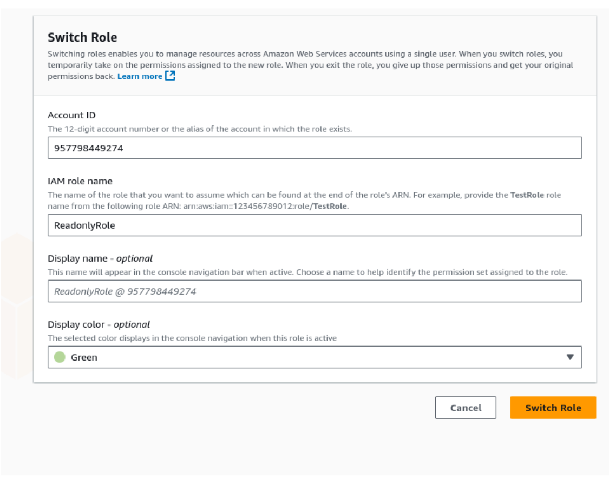

1. **Set-up account.** Register in a cloud provider. Now you have a root account. **(1 point)**  
   Now perform one of the following (you need to select only one action):  
   a. Create an IaM user and attach FullAdmin policy. Use it for all future interactions with the system. **(1 point)**

   We can the the result of creation on IAM User at the screenshots below
   

   And more detailed information of  user here:
   
---
2. *(Optional)* Create an Organisation  
   [docs.aws.amazon.com/organizations/latest/userguide/orgs_tutorials_basic.html](https://docs.aws.amazon.com/organizations/latest/userguide/orgs_tutorials_basic.html)  
   and user for it. All next labs are to be performed within it. **(2 points)**  
---
3. Create one more user. Create an IaM policy that allows **ONLY** to view resources (no write access). **(1 point)**
   Now lets create the second user, that will only have an access to view resources. On the screenshot below, we can see the result of creation the second user
    
   And more detailed information:
   
---
4. Create a Role that has this policy attached and can be assumed by user from p3. **(1 point)**  
 Created Readonly Role with attached policy on the screenshot below:
   

   After that , lets crate a policy for  User for assuming this role:
   

   Login via IAM Readonly User:
   

   As we can see, initially we have no access to anything:
   

   Click the change role button in the right corner menu and enter the data about the role you want to use.
   

   After that get the role and get ReadOnlyAccess:
   

   As you can see, now we have a readonly access and see the statistics and etc. Also at the top you can see the role that was granted to the user.
   
   
---
5. *(Optional)* Create a CloudFormation (or Terraform, OpenTofu, whatever) template describing your policy and role. **(1 point)**
   Lets create a .yaml cloudformation code to describe our policies and etc manually:
   

   Create a stack and upload this yaml file:
   

   Created stack:
   

   Stack assume policies and roles:
   
---
6. Create a network (VPC for your resources). There should be private and public subnets.  
   Public one has IGW, private ones are for internal access only. **(3 points)** 

   We can see created VPC in the screenshot below:
   

   Lets create public and private subnets:
   
   
   

   Create internet gateway:
    

   Create public route table and connect it to IG. Also create private RouteTable:
    
    
  
   
---
7. *(Optional)* Create IaC stack holding your network resources. **(2 points)**

   Lets create IaC stack to hold my network resourses. Firstly, scan resourses:
   

   Now, add scaned resources that we want to see in the template:
   
   
   

   After that we can see created IaC template:
   

   Here we can see it in code:
   
   
---
8. Calculate monthly budget for lab 2, assuming there will be only 2 shards. **(2 points)**

1) EC2 (3 × t2.micro)
0.0134 $/год × 730 h × 3 = $29.35/month. 

2) EBS gp3 ( 60 GB)
60 GB × 0.119 $/GB-міс = $7.14/month. 

3) ALB (1 instance, ~1 LCU)
(0.0225 + 0.008) $/h × 730 = $22.27/month. 

4) NAT Gateway (1 шт.)
0.045 $/h × 730 = $32.85/month. 

Data processing via NAT (for example 10 GB/month for update): 10 × 0.045 = $0.45/h. 

5) Data transfer out (ex. ~50 GB/month)
Keep it free until < 100 GB ⇒ $0. 

6) Cloudwatch, logs, snapshots
For example $1.50/month

Result (t2.micro)

EC2: $29.35
EBS: $7.14
ALB: $22.27
NAT GW (h): $32.85
NAT data processing (~10 GB): $0.45
Other: $1.50

Sum ≈ $93.6/month

If NAT traffic is higher, add $0.045/GB; if Internet access >100 GB/month, add the regional data access rate.
---
